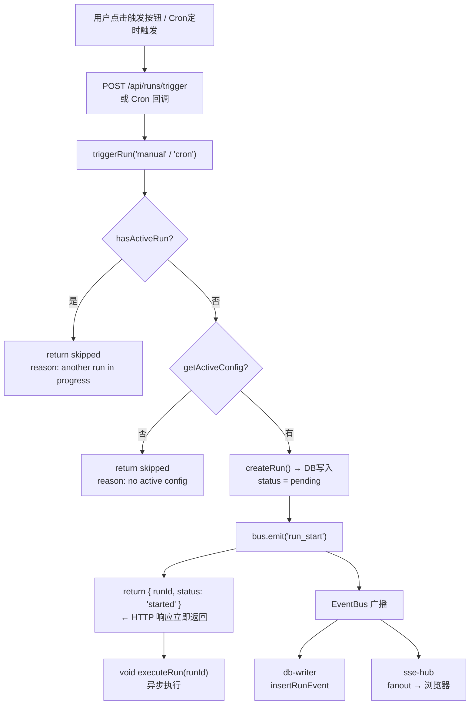
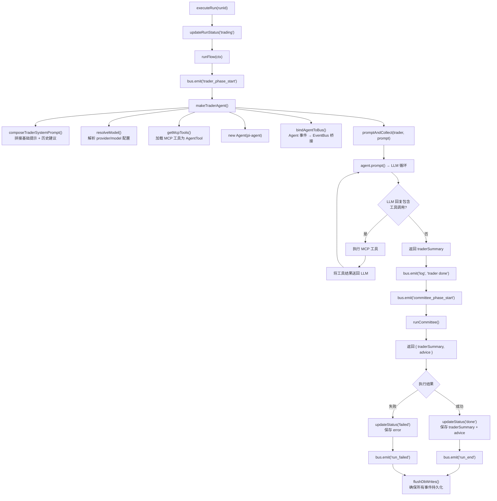
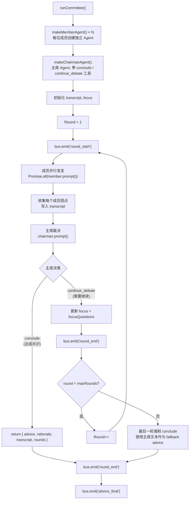
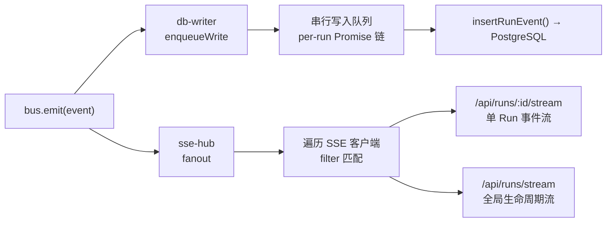
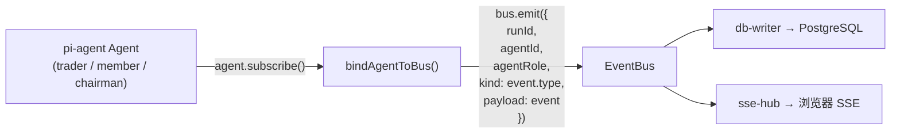
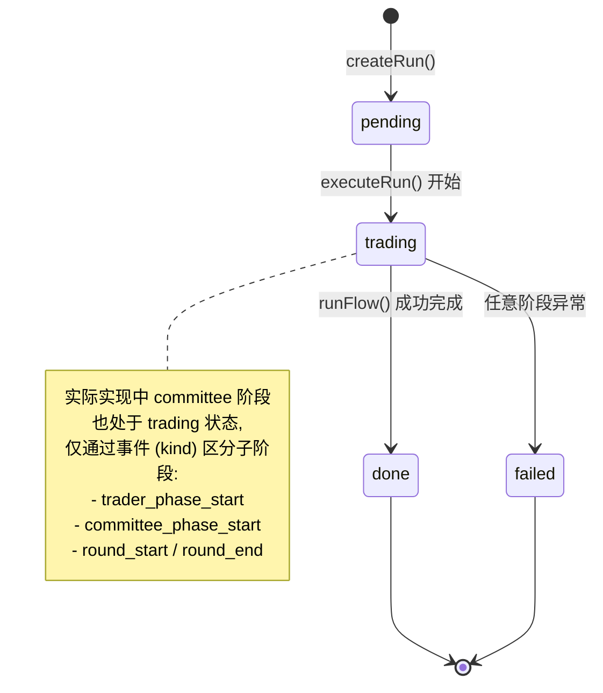
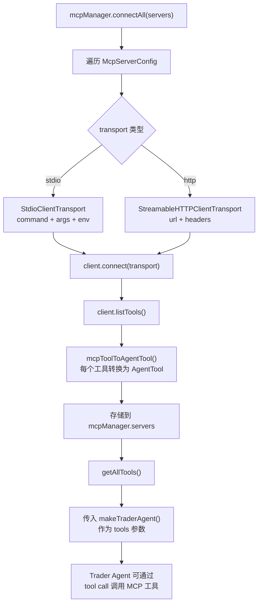

# Trade-Agent 执行流程分析

## 整体触发流程

## executeRun 主流程

## 委员会多轮讨论流程

## 事件总线消费链路

## Agent 事件桥接机制

## Run 状态流转

## MCP 工具集成流程

## 关键设计要点

1. **触发即返回** — `triggerRun` 创建 run 后用 `void executeRun()` 异步执行，HTTP 立即返回 `runId`
2. **事件驱动** — 所有阶段通过 `bus.emit` 广播事件，前端通过 SSE 实时接收进度
3. **串行写入** — db-writer 用 per-run 的 Promise 链保证事件按 `seq` 顺序入库
4. **委员会多轮** — 成员并行发言，主席串行裁决，最多 `maxRounds` 轮，最后一轮强制结束
5. **Agent 事件桥接** — `bindAgentToBus()` 将 pi-agent 内部事件（工具调用、LLM 请求/响应）转发到全局 EventBus
6. **MCP 工具适配** — MCP 工具通过 `mcpToolToAgentTool()` 转换为 pi-agent 的 `AgentTool` 接口，工具名做安全化处理

## 文件职责速查

| 文件 | 职责 |
|------|------|
| `src/http/routes/runs.ts` | HTTP 路由：触发、查询 runs/events |
| `src/orchestrator/runner.ts` | 入口：`triggerRun()` + `executeRun()`，状态管理与错误恢复 |
| `src/orchestrator/flow.ts` | 用户可编辑的流程编排：先 trader 后 committee |
| `src/orchestrator/committee.ts` | 委员会多轮讨论逻辑 |
| `src/orchestrator/helpers.ts` | Agent 工厂：`makeTraderAgent` / `makeMemberAgent` / `makeChairmanAgent` |
| `src/orchestrator/agent-events.ts` | Agent 事件 → EventBus 桥接 |
| `src/bus/event-bus.ts` | 全局事件总线（发布/订阅） |
| `src/bus/db-writer.ts` | 事件持久化：串行队列写入 PostgreSQL |
| `src/bus/sse-hub.ts` | SSE 推送：事件实时广播到浏览器 |
| `src/mcp/manager.ts` | MCP 服务器连接管理 |
| `src/mcp/tool-adapter.ts` | MCP 工具 → AgentTool 适配器 |
| `src/ai/models.ts` | LLM 模型解析与 API Key 获取 |
| `src/cron/scheduler.ts` | Cron 定时调度 |
| `src/db/repo.ts` | 数据库 CRUD 操作 |
